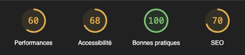
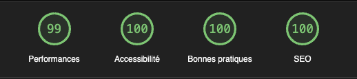

# P05-Nina_Carducci_SEO_Debugg

# 🌐 Optimisation d'un Site Web d'Architecte 🏛

## 📌 Table des Matières
- [📖 À Propos du Projet](#-à-propos-du-projet)
- [🚀 Étapes Clés](#-étapes-clés)
- [🎯 Compétences Évaluées](#-compétences-évaluées)
- [🎤 Soutenance](#-soutenance)
- [📞 Contact](#-contact)

## 📖 À Propos du Projet
Ce projet a été réalisé dans le cadre d'une évaluation de compétences en optimisation de site web. L'objectif principal était d'améliorer les performances, le SEO, l'accessibilité et de corriger certains bugs du site web d'un architecte.

## 🚀 Étapes Clés

1. **Récupération dynamique des données** : Utilisation de la version 1 de l’API développée pour récupérer les données des travaux. Les informations nécessaires pour les différentes routes sont fournies via le document Swagger.
2. **Tri des projets par catégorie** : Mise en place d'un système de filtrage pour afficher les travaux selon leur catégorie. Par exemple, en cliquant sur "Office", seuls les travaux de cette catégorie sont affichés.
3. **Intégration de la page de connexion** : Mise en place d'un formulaire de connexion. En cas d'erreur d'identification, un message d'erreur est affiché. Une fois connecté, l'utilisateur accède à une version éditée du site.
4. **Gestion des projets via une modale** : Création d'une fenêtre modale pour gérer la liste des projets. Les projets sont affichés comme indiqué dans le design. Il est possible de supprimer un travail en cliquant sur l'icône de la corbeille.
5. **Formulaire d'ajout de projet** : Mise en place d'un formulaire permettant d'ajouter un projet avec une image, un nom et une catégorie.

### 📸 Captures d'écran de Lighthouse

**Avant Optimisation** :

**Après Optimisation** :

## 🎯 Compétences Évaluées

1. **Rédaction d'un cahier de recette** : Validé.✅ La section “Cahier de recette” a été remplie avec des cas d'usage attendus et détaillés.
2. **Débuggage avec Chrome DevTools** : Validé.✅ Les catégories et les flèches de la modale fonctionnent au clic comme attendu.
3. **Optimisation des performances d’un site web** : Validé.✅ Les optimisations obligatoires ont bien été effectuées, ainsi que la plupart des optimisations optionnelles. Le rapport d'investigation est détaillé et contient toutes les informations attendues.

## 🎤 Soutenance (évaluateur: Mamadou Lamine Dia)

**Points forts** :
- Toutes les fonctionnalités ont été implémentées.
- Utilisation de fetch, localStorage, etc.
- Code propre et commenté.

**Axes d'amélioration** :

**Remarques** :
La présentation effectuée par l'étudiant a été plutôt complète et détaillée. Tous les points essentiels ont été abordés de façon très détaillée, montrant une bonne maîtrise des processus d'optimisation et d'amélioration d'un site web. Bonne performance. Bravo.

## 📞 Contact
Pour toute question ou commentaire, n'hésitez pas à me contacter.

**Beau travail et bonne continuation !** 🎉
